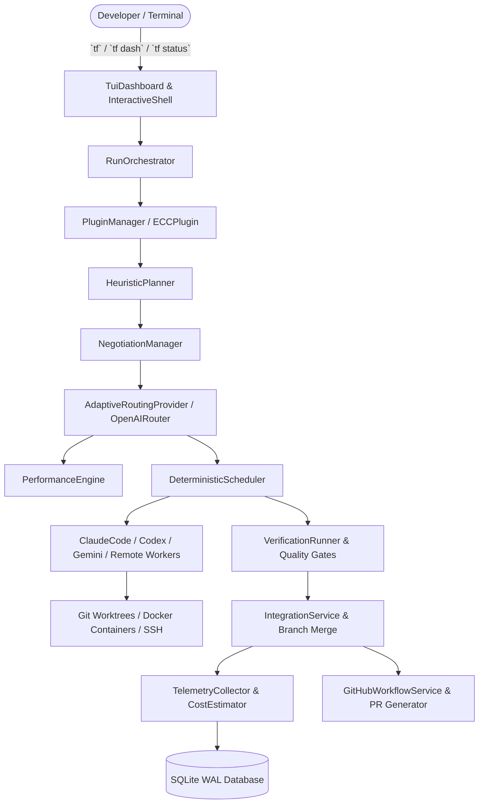

# TaskForge: Architecture & Verification Guide (Phases 14–22)
**Milestones 3, 4 & 5: Real-Agent E2E, Plugin System, ECC Integration, Telemetry, Performance Engine, Adaptive Routing, TUI Dashboard, GitHub Workflows, and Remote Workers**

---

## 1. Overview & Architectural Foundations

Phases 14 through 22 complete the entire TaskForge product engineering specification (`taskforge-complete-product-engineering-spec.md`), elevating TaskForge from an isolated scheduler into a production-grade, local-first multi-agent software engineering system.

The core invariants of TaskForge (Section 29.1) remain strictly enforced:
> **Local-first architecture**: Git worktree isolation (`.taskforge/worktrees`), native Git CLI operations, zero distributed control planes, zero Kubernetes dependencies, zero hosted accounts or billing bloat, and zero vector database dependencies. Deterministic Node.js/TypeScript code governs state transitions, file access boundaries, process lifecycles, and verification.

---

## 2. Package Architecture (Phases 14–22)

| Package / Module | Role & Responsibility | Spec Reference |
|---|---|---|
| `@taskforge/agents` | Real-agent adapters (`ClaudeCodeAdapter`, `CodexAdapter`, `GeminiCliAdapter`), fake agent (`FakeAgent`), and remote worker adapters (`DockerWorkerAdapter`, `SshWorkerAdapter`). | Section 9, 17, 22 |
| `@taskforge/plugins` | Modular Plugin SDK: `TaskForgePlugin` interface, lifecycle hooks (`onRunStart`, `beforePlan`, `afterPlan`, `beforeTask`, `afterTask`, `verify`, `onRunComplete`), error isolation, and `ECCPlugin` for selective capability/rule injection. | Section 21 |
| `@taskforge/telemetry` | Multi-model token cost estimation (`CostEstimator`), execution telemetry recording (`TelemetryCollector`), and historical performance aggregation (`PerformanceEngine`). | Section 26, 31 |
| `@taskforge/router` | Adaptive routing provider (`AdaptiveRoutingProvider`) biasing staffing toward historically proven agent-role configurations with uncertainty reporting. | Section 8, 26 |
| `@taskforge/conversation` | Full TUI dashboard (`TuiDashboard`) with ASCII/Unicode DAG visualizer, status badges, active worktree monitoring, agent health matrix, and terminal telemetry views. | Section 4, 20, 25 |
| `@taskforge/integration` | GitHub integration (`GitHubWorkflowService`) with GFM PR generation, audit trail evidence, test results summary, issue importing (`tf issue <number>`), and `gh pr create` automation. | Section 21, 25 |

---

## 3. Detailed Phase Breakdown

### Phase 14: Real-Agent E2E v0.1
- **Real Agent Adapters**:
  - `ClaudeCodeAdapter`: Wraps native Anthropic `claude` CLI with `--print` and non-interactive automation flags.
  - `CodexAdapter`: Wraps OpenAI `codex` CLI with quiet flags.
  - `GeminiCliAdapter`: Wraps Google `gemini` CLI with automation flags.
- **Run Orchestrator (`RunOrchestrator`)**:
  - Unifies the end-to-end lifecycle: Goal Parsing → Planning → Preflight Negotiation → Adaptive Routing → Worktree Provisioning → Execution → Verification → Cherry-pick Integration → Telemetry Recording.
  - Transparent fallback to `FakeAgent` during testing or when real CLI tools lack authentication (`--fake`).

### Phase 15: Plugin SDK (`packages/plugins`)
- **Plugin Interface & Architecture**:
  - Type-safe hook system: `onRunStart`, `beforePlan`, `afterPlan`, `beforeTask`, `afterTask`, `verify`, `onRunComplete`.
  - **Error Isolation**: Plugin crashes or hook rejections are caught and logged without aborting core scheduler workflows.
  - **Zero External Dependencies**: Core TaskForge executes cleanly with zero plugins registered.

### Phase 16: Everything-Claw-Compatible (ECC) Plugin
- **Selective Capability Injection**:
  - Detects existing `.claw` or ECC rules in the repository (`ECCDetector`).
  - Filters relevant software engineering patterns (backend, TDD, security review, typecheck) while stripping out irrelevant skills (Kubernetes, cloud, ML).
  - Injects contextual rules into task preflight acceptance criteria and verification quality gates.

### Phase 17: Telemetry & Cost Tracking (`packages/telemetry`)
- **Cost Estimator**:
  - Accurate multi-model token pricing (Claude 3.7 Sonnet, GPT-4o, Gemini 2.0 Flash, OpenAI o1/o3).
  - Calculates input, output, cached, and reasoning token costs.
- **Telemetry Persistence**:
  - SQLite persistence in `cost_tracking` and `run_metrics` tables with WAL mode.
  - Commands: `/cost` and `/stats` accessible via CLI and REPL.

### Phase 18: Performance Engine (`packages/telemetry`)
- **Historical Analysis**:
  - Aggregates historical executions by `agent × role × task_type × complexity`.
  - Computes `successRate`, `firstPassRate`, `averageDurationMs`, `reworkRate`, `escalationRate`, and `compositeScore`.
  - Enforces minimum sample size (`minSampleSize = 3`) with confidence/uncertainty intervals to prevent bias on sparse data.

### Phase 19: Adaptive Routing (`packages/router`)
- **Data-Driven Staffing**:
  - `AdaptiveRoutingProvider` wraps base routing strategies.
  - Biases role staffing toward agents with proven historical success rates on identical task types.
  - Guarded behind configuration flag `router.adaptive: true`, falling back safely to deterministic rules when metrics are sparse.

### Phase 20: Advanced UX & TUI Dashboard (`packages/conversation`)
- **Visual Terminal Dashboard (`TuiDashboard`)**:
  - ASCII/Unicode task dependency DAG graph visualizer.
  - Live execution status badges (`[READY]`, `[RUNNING]`, `[VERIFYING]`, `[COMPLETED]`, `[FAILED]`).
  - Active worktree inspection boxes showing task bindings and working paths.
  - Agent health and capability matrix.
  - Integrated commands: `tf status`, `tf dash`, `/dash`, `/graph`.

### Phase 21: GitHub Workflow Integration (`packages/integration`)
- **Automated Pull Requests & Issue Ingestion**:
  - `GitHubWorkflowService`:
    - `importIssue(issueNumber)`: Ingests title, body, and labels via `gh issue view` or local mock fallback, converting issues directly into TaskForge goals.
    - `generatePullRequestSummary()`: Compiles GFM pull request descriptions containing verification audit trails, diff statistics, token telemetry, and task breakdowns.
    - `createPullRequest()`: Invokes native `gh pr create` with graceful manual fallback when `gh` CLI is absent.
  - CLI command: `tf issue <number>`.

### Phase 22: Remote Workers (`packages/agents`)
- **Isolated Execution Adapters**:
  - `DockerWorkerAdapter`: Executes worker tasks inside ephemeral Docker containers with isolated volume mounts (`-v <worktree>:/workspace`), memory/CPU constraints, and restricted networking.
  - `SshWorkerAdapter`: Executes tasks on remote worker nodes via SSH with secure working directory isolation.
  - Conforms strictly to the `AgentAdapter` interface, allowing plug-and-play distribution while preserving local Git integrity.

---

## 4. Verification & Test Evidence

All 23 phases are verified by automated end-to-end and unit test suites:
- **Test Command**: `pnpm test`
- **Result**: **19/19 test files passed (64/64 tests passed)**
- **Typecheck**: `pnpm typecheck` (`tsc -b`) cleanly passes with zero errors across all 19 workspace packages.
- **Linter**: `pnpm lint` cleanly passes with **0 errors and 0 warnings**.
