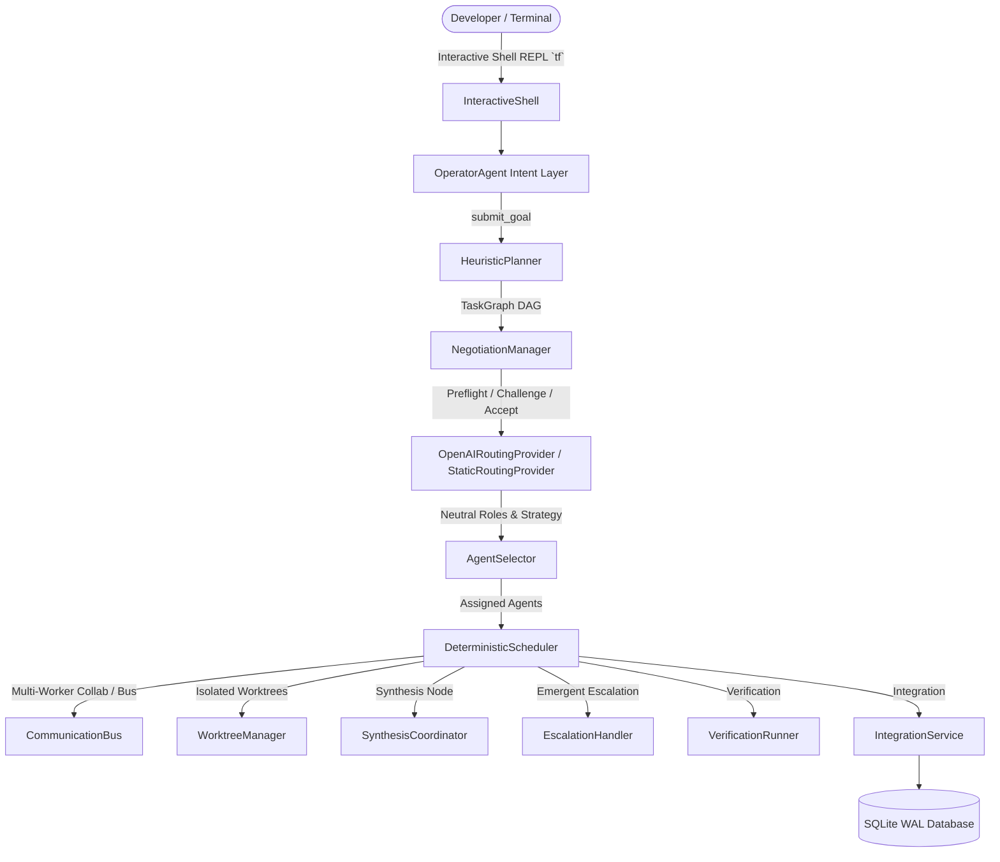

# TaskForge: Architecture & Verification Guide (Phases 6–13)

**Milestone 2: Conversational REPL, Operator Agent, Dynamic Planning, Negotiation, Routing, and Collaborative Multi-Agent Execution**

---

## 1. Overview & Architectural Foundations

Milestone 2 implements the conversational control plane, dynamic task generation, structured preflight negotiation, provider routing, agent selection, structured message bus, and collaborative multi-agent execution workflows specified in Sections 4, 5, 6, 7, 8, 9, 10, 11, 12, 13, and 34 of `taskforge-complete-product-engineering-spec.md`.

The core invariant of TaskForge is maintained at all times:

> **AI models propose, interpret, and challenge. Deterministic TypeScript/Node.js control plane code governs state transitions, Git operations, permissions, process execution, and verification.**



---

## 2. Package Architecture (Milestone 2)

| Package                    | Role & Responsibility                                                                                                                                                                                                                                  | Spec Reference         |
| -------------------------- | ------------------------------------------------------------------------------------------------------------------------------------------------------------------------------------------------------------------------------------------------------ | ---------------------- |
| `@taskforge/conversation`  | Interactive CLI REPL (`tf`), terminal banner with repository health, clean/modified status, detected agents, router status, and ECC detection.                                                                                                         | Section 6, 24          |
| `@taskforge/operator`      | Natural language intent parser (Portuguese and English) and slash commands (`/tasks`, `/agents`, `/plan`, `/pause`, `/resume`, `/reassign`, `/constraint`). Formats responses without executing code directly.                                         | Section 4, 5           |
| `@taskforge/planner`       | `HeuristicPlanner` breaking goals into DAGs with strict `TaskContract` (allowedScope, forbiddenChanges, acceptanceCriteria, dependencies). Propagates goal constraints to all subtasks.                                                                | Section 7, 28          |
| `@taskforge/negotiation`   | Worker Preflight protocol: evaluates contracts before execution. Handles `accept`, `challenge`, `need_dependency`, `recommend_merge`, updating the `TaskGraph` deterministically and auditing to `preflight_results`.                                  | Section 8              |
| `@taskforge/router`        | Routing decisions with strict JSON Schema via OpenAI Structured Outputs (`OpenAIRoutingProvider`) with resilient fallback to deterministic heuristics (`StaticRoutingProvider`). Classifies roles neutrally without vendor bias.                       | Section 9, 29          |
| `@taskforge/collaboration` | `CommunicationBus` with message guardrails (max 10 messages/round, loop prevention, persistence in `agent_messages`), `AssignmentGraph` with parallel investigation and `SynthesisCoordinator`, and `EscalationHandler` for `COLLABORATION_ESCALATED`. | Section 10, 11, 12, 13 |
| `@taskforge/scheduler`     | Enhanced `DeterministicScheduler` supporting preflight negotiation hooks, collaborative multi-assignment execution, and emergent collaboration escalation.                                                                                             | Section 13, 20         |
| `apps/cli`                 | Invoking `tf` with no arguments directly launches the interactive conversational REPL shell.                                                                                                                                                           | Section 6, 34          |

---

## 3. Detailed Phase Breakdown

### Phase 6: Interactive Shell REPL (`tf`)

- Running `tf` opens the interactive prompt `> `:

```text
 TaskForge
 /Users/edereduardo/projects/taskforge  •  main  •  clean

 Agents
 Claude Code  ● ready
 Codex CLI    ● ready
 Gemini CLI   ○ not detected

 Router
 OpenAI       ● ready

 ECC
 ○ not detected
────────────────────────────────────
> _
```

- Real-time detection of local harness readiness (`claude`, `codex`, `gemini`).
- Clean exit via `/exit` or `/quit` with graceful stream teardown.

### Phase 7: Operator Agent Intent Layer

- Interprets user input via rule-based semantic NLP with zero hallucination.
- Supported operations:
  - **Inspection**: `/tasks`, `/agents`, `/plan`, `/cost`, "como estão as tarefas?", "quais agentes estão disponíveis?".
  - **Runtime Control**: `/pause`, `/resume`, "pausar a execução", "retomar a execução".
  - **Scope Constraints**: `/constraint ...`, "não altere o arquivo package.json", "não mexa em db/**".
  - **Reassignment**: `/reassign TASK-1 agent-2`, "cancele a tarefa TASK-1 e reatribua para codex".
  - **Goal Proposal**: "implemente autenticação JWT", "investigar e resolver memory leak crítico".

### Phase 8: Planner

- Generates topologically valid `TaskGraph` instances.
- Populates explicit `TaskContract` on each node:
  - `allowedScope`: Glob patterns of files writable by this task.
  - `forbiddenChanges`: Explicit forbidden paths (e.g. `package.json`, schema migrations, goal-level constraints).
  - `acceptanceCriteria`: Objective verification criteria.
  - `dependencies`: Upstream task IDs required before task can execute.

### Phase 9: Task Contract & Preflight Negotiation

- Before execution, contracts are presented to worker agents.
- Workers return structured `TaskPreflightResult`:
  - `accept`: Task transitions `preflight -> accepted -> ready`.
  - `challenge` / `need_dependency`: Identifies missing prerequisites or unmentioned risks. Negotiator automatically injects dependencies and scope constraints into the `TaskGraph` and records `TASK_CHALLENGED` and `TASK_ACCEPTED` events.
- All decisions persisted in SQLite `preflight_results` table.

### Phase 10: Router Provider (Strict Structured Output + Static Fallback)

- Neutral taxonomy of roles: `researcher`, `reproduction_engineer`, `lead`, `implementer`, `reviewer`, `tester`, `architecture_reviewer`, `security_reviewer`, `critic`, `integrator`.
- Provider selects strategy: `single`, `pair`, `parallel`, `partitioned`, `competitive`, `review`, `collaborative`, `swarm`.
- Strict JSON Schema with fallback to `StaticRoutingProvider` when API keys are absent or network errors occur.

### Phase 11: Agent Selector

- Maps abstract role requests (e.g. `researcher` needing `canRead`, `implementer` needing `canWrite`) to concrete available agents registered in `AgentRegistry` (Claude, Codex, Gemini, or specialized workers).

### Phase 12: Agent Communication Bus

- Inter-agent messaging system supporting types: `query`, `finding`, `challenge`, `proposal`.
- Enforces guardrails:
  - Configurable message limits per round (default 6 to 10).
  - Maximum communication rounds (default 3).
  - Throws `CollaborationLimitError` when limits are exceeded.
- Every message audited to SQLite table `agent_messages` and event `AGENT_MESSAGE_SENT`.

### Phase 13: Collaborative Execution, Synthesis, and Emergent Escalation

- **Parallel Investigation**: Multiple agents (e.g., 3 FakeAgents) investigate different aspects simultaneously in isolated Git worktrees.
- **Synthesis Node (`SynthesisCoordinator`)**: Synthesizes evidence, root causes, and recommended fixes before the implementer generates code changes.
- **Emergent Escalation (`COLLABORATION_ESCALATED`)**: When a worker discovers scope complexity exceeding single-agent capacity, it returns `CollaborationProposal`. The control plane emits `COLLABORATION_ESCALATED` and halts or reorganizes assignments.

---

## 4. Verification & Test Evidence

All 14 test suites across the monorepo pass cleanly with 100% success rate:

```bash
pnpm lint && pnpm typecheck && pnpm test
```

### Test Summary

- **14 Test Files Passed**
- **44 Tests Passed**
- **0 Failures, 0 Warnings**

```
 ✓ packages/shared/tests/config.test.ts (3 tests)
 ✓ packages/persistence/tests/repositories.test.ts (4 tests)
 ✓ packages/execution/tests/process-runner.test.ts (4 tests)
 ✓ packages/workspace/tests/workspace.test.ts (3 tests)
 ✓ packages/agents/tests/agents.test.ts (3 tests)
 ✓ packages/core/tests/task-graph.test.ts (5 tests)
 ✓ packages/planner/tests/planner.test.ts (1 test)
 ✓ packages/negotiation/tests/negotiation.test.ts (2 tests)
 ✓ packages/router/tests/router.test.ts (3 tests)
 ✓ packages/collaboration/tests/collaboration.test.ts (4 tests)
 ✓ packages/operator/tests/operator.test.ts (3 tests)
 ✓ packages/conversation/tests/shell.test.ts (2 tests)
 ✓ tests/e2e-phases0-5.test.ts (2 tests)
 ✓ tests/e2e-phases6-13.test.ts (5 tests)
```
