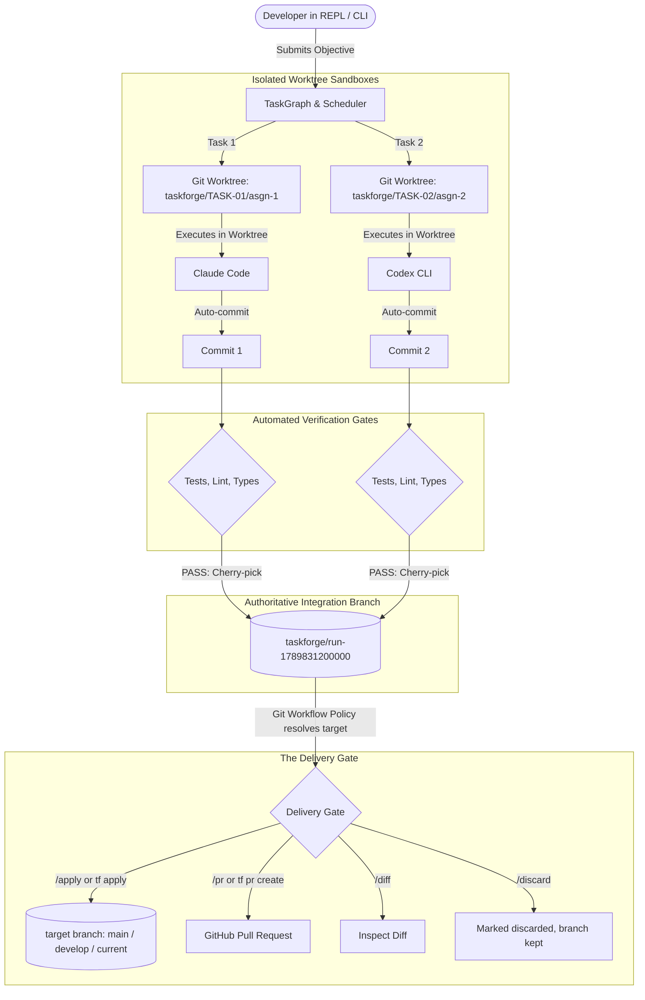

# TaskForge Git Worktrees, Branch Lifecycle & Real-Agent Hardening Guide

**Document Status:** Official Reference & User Guide  
**Version:** v0.2.0  
**Target Audience:** Developers, Platform Engineers, and Multi-Agent Systems Architects  

---

## 1. Executive Summary & The Problem Statement

When using TaskForge to coordinate autonomous AI agents (such as **Anthropic Claude Code**, **OpenAI Codex CLI**, or **Google Antigravity**), developers often have three critical questions:

1. **"Why didn't TaskForge modify or commit directly to my `main` branch?"**
2. **"If I close the terminal or restart TaskForge, how do I know if the task succeeded and what branch the changes were saved to?"**
3. **"The run says COMPLETED — how does my code actually get into my branch?"**

This document explains the **Zero-Risk Git Worktree Architecture**, how integration branches (`taskforge/run-<runId>`) are named, discovered, and merged, the **Delivery Gate** that turns a completed run into an applied change or a pull request, the **Git Workflow Policy** that decides which branch that change targets, and the **Real-Agent Hardening** safeguards that protect your codebase and secrets.

---

## 2. The Zero-Risk Git Architecture

Allowing autonomous AI agents to modify a developer's active working directory or commit directly to `main` is inherently risky. Agents could introduce regressions, overwrite uncommitted local work, or cause merge conflicts midway through a run.

TaskForge eliminates this risk through a 5-step lifecycle:



### Step 1: Ephemeral Worktrees (`.taskforge/worktrees/`)
For each task in the dependency graph, TaskForge calls `git worktree add` to create an isolated filesystem sandbox checked out from the base commit. Your active working copy on `main` remains 100% untouched.

### Step 2: Agent Execution & Auto-Commit
The assigned agent works strictly inside its ephemeral worktree. When the agent finishes, TaskForge stages the files and creates an autonomous Git commit tagged with the task ID:
```
feat(TASK-01): completed by Claude Code
```

### Step 3: Deterministic Automated Verification
Before any change is accepted, TaskForge executes the repository's verification suite (`pnpm test`, `pnpm lint`, `tsc`) inside the worktree sandbox. If verification fails, TaskForge launches a bounded rework cycle.

### Step 4: Atomic Integration to `taskforge/run-<runId>`
Once verified, TaskForge creates a dedicated integration branch for the entire run:
```
taskforge/run-<runId>    (e.g., taskforge/run-1789831200000)
```
Each verified task commit is cherry-picked onto this integration branch in deterministic dependency order.

### Step 5: The Delivery Gate
At the end of a successful run, TaskForge does **not** just print a `git merge` command and leave you to run it. It resolves the target branch (see [§3.5 Git Workflow Policy](#35-git-workflow-policy)), marks the run `ready_to_apply`, and shows a delivery gate instead of a status line:
```text
✔ Task completed successfully

  Verification   ✔ passed
  Delivery       ● READY TO APPLY

  /apply    apply to main
  /diff     inspect changes
  /pr       create pull request
```
Temporary worktrees are automatically pruned, leaving your repository clean. The integration branch itself is **not** deleted — it stays until you `/apply`, `/pr`, or `/discard` it (see §3 below).

---

## 3. The Delivery Gate: Apply, Diff, PR, or Discard

If you closed TaskForge, restarted your terminal, or ran tasks in the background, you never need to guess where your changes are — and you never have to hand-type a `git merge` command.

### 3.1 Inspecting Runs (`tf runs` / `/runs`)
```bash
tf runs
```
or, inside the interactive shell, `/runs`. Each completed run shows its **execution** status separately from its **delivery** status — a run can be `COMPLETED` while its delivery is still `READY TO APPLY`, `APPLIED`, `PR opened`, or `discarded`:
```text
  ✦ TaskForge Runs History
  ────────────────────────────────────────────────────────────────
  ● run-1789852516195 [COMPLETED] ✔ COMPLETED (2026-09-19 18:15:16)
    Goal:     Implement Redis-backed idempotency lock
    Branch:   taskforge/run-1789852516195
    Delivery: ● READY TO APPLY
    /apply run-1789852516195    /diff run-1789852516195    /pr run-1789852516195
  ────────────────────────────────────────────────────────────────
```

### 3.2 Applying a Run (`/apply`, `tf apply`)
```bash
tf apply                    # applies the latest run whose delivery is READY TO APPLY
tf apply run-1789852516195   # applies a specific run
```
or, in the REPL, `/apply` (also understands natural language: "aplica as mudanças", "merge this", "put this on main"). Before touching your target branch, `DeliveryService` runs a real preflight:
1. **Working tree clean?** (TaskForge's own `.taskforge/` state directory is excluded from this check — only *your* uncommitted changes block an apply.)
2. **Already applied?** If the integration branch is already an ancestor of the target branch, `/apply` is a no-op that reports success, not an error.
3. **Would it conflict?** A real merge is attempted with `--no-commit --no-ff` and immediately aborted if it doesn't apply cleanly — your target branch is **never** left in a partial merge state.

```text
✦ Applying run-1789852516195

  Target branch..........  main
  Integration branch.....  taskforge/run-1789852516195

✔ Changes applied successfully.

  main  a78f128 → d935ab2
```
If there's a conflict, TaskForge reports exactly which files conflict and does not touch the target branch:
```text
✦ Integration conflict detected

main has changes that conflict with taskforge/run-1789852516195.

Conflicting files:
  packages/memory/src/service.ts

I won't touch main. Inspect with /diff run-1789852516195, resolve manually, then retry /apply.
```

### 3.3 Inspecting Changes (`/diff`)
Inside the REPL, `/diff` (or `/diff run-<id>`) shows the file/line diff-stat between the target branch and the integration branch before you decide to apply. There is no `tf diff` CLI command yet — use plain `git diff` (§3.7) from a script or CI.

### 3.4 Creating a Pull Request (`/pr`, `tf pr create`)
```bash
tf pr create --base main
```
or, in the REPL, `/pr`. This uses the same `GitHubWorkflowService` either way — a rich PR body with tasks executed, verification evidence, and token cost, via `gh pr create`.

### 3.5 Git Workflow Policy: Which Branch Does `/apply` Target?
By default (`git.workflow: trunk`), the target branch is whatever branch you were on when the run started — nothing to configure. Three more strategies are available in `.taskforge/config.yaml`:
```yaml
git:
  workflow: trunk           # trunk (default) | github-flow | gitflow | current-branch
  targetBranch: main        # used by trunk & github-flow; optional
  branches:
    production: main        # used by gitflow
    development: develop    # used by gitflow
```
- **`trunk`** / **`current-branch`**: always target a fixed branch (`targetBranch`, default `main`) or whatever branch is currently checked out, respectively.
- **`github-flow`**: same target-branch resolution as `trunk` — the difference is organizational; it pairs naturally with `delivery.mode: pull_request` below.
- **`gitflow`**: targets `branches.development` (`develop`) by default, or `branches.production` (`main`) if the goal text looks like a hotfix (contains words like "hotfix", "urgent", "critical", "production crash/incident") — and always falls back to `production` if `develop` doesn't actually exist in the repo.

If TaskForge detects both a `main`/`master` and a `develop` branch while you're still on the default `trunk` workflow, it prints a one-time, non-blocking suggestion to switch to `gitflow` — it never rewrites your config file for you.

### 3.6 Choosing What Happens Automatically (`delivery.mode`)
```yaml
delivery:
  mode: ask_human      # ask_human (default) | auto_apply | pull_request | branch_only
  targetBranch: main   # optional manual override, takes priority over Git Workflow Policy
```
- **`ask_human`** (default): the run ends `READY TO APPLY`; you decide with `/apply`, `/pr`, or `/discard`.
- **`auto_apply`**: TaskForge applies automatically at the end of a successful run — but only if `permissions.git.merge_main: allow` is also set (a second, explicit opt-in; the default `deny` blocks this even if `delivery.mode` is `auto_apply`, so unattended merges are never a config accident).
- **`pull_request`**: TaskForge opens a PR automatically at the end of a successful run.
- **`branch_only`**: leaves the integration branch in place; delivery stays `pending` until you act.

### 3.7 Standard Git Commands
Because TaskForge is pure Git under the hood, standard Git commands still work instantly:
```bash
git branch --list 'taskforge/*'
git log --oneline -n 5 taskforge/run-1789852516195
git diff main..taskforge/run-1789852516195
```

### 3.8 Discarding a Run (`/discard`)
```text
> /discard run-1789852516195
Run run-1789852516195 marked as discarded. The integration branch was kept, nothing was merged.
```
Discarding is bookkeeping only — the branch is never deleted, so you can always go back to it with plain Git.

### 3.9 Cleaning Up Worktrees (`tf clean`)
If an agent crashed, was aborted via `Ctrl+C`, or left orphaned worktrees in `.taskforge/worktrees/`:
```bash
tf clean
```
> [!NOTE]
> `tf clean` safely prunes orphaned temporary worktrees and transient assignment branches, but **never** deletes completed `taskforge/run-<runId>` integration branches or your SQLite history.

---

## 4. Real-Agent Hardening (v0.1 Safe-by-Default Architecture)

To bridge the gap between deterministic software and external CLI agents, TaskForge implements the **Real-Agent Hardening Specification**:

### 4.1 No Silent CLI Bypass
Previous integrations sometimes relied on flags like `--dangerously-skip-permissions` (Claude Code) or `--dangerously-bypass-approvals-and-sandbox` (Codex CLI) to prevent agents from blocking on terminal prompts.

**TaskForge permanently eliminates these flags.** Real CLI harnesses are run without bypass flags, ensuring that dangerous operations cannot execute without governance.

### 4.2 Strict Environment Allowlist & Secret Redaction
When spawning agent subprocesses, TaskForge enforces a strict environment isolation policy:
- **`inherit: false`**: Subprocesses do not inherit arbitrary environment variables.
- **`allow`**: Only explicitly needed system paths (`PATH`, `HOME`, `USER`, `SHELL`) and AI provider keys (`ANTHROPIC_API_KEY`, `OPENAI_API_KEY`, `GEMINI_API_KEY`, etc.) are passed.
- **`denyPatterns`**: Automatically strips any variable matching:
  - `*PASSWORD*`
  - `*SECRET*`
  - `*TOKEN*` (e.g. `GITHUB_TOKEN`, `AWS_SECRET_ACCESS_KEY`)
  
This prevents accidental token leakage to third-party tools or remote servers.

### 4.3 Bidirectional I/O & `RealCliAgentSession`
Instead of treating agent processes as opaque black boxes, TaskForge connects directly to child process `stdin`, `stdout`, and `stderr`:
1. **JSON Event Parsing**: Real-time line-by-line parsing intercepts structured `permission_request`, `question`, and `authentication_required` events.
2. **Tool Use Inspection**: High-risk tool calls (such as `Bash` commands executing `rm -rf`, `sudo`, `npm install`, or `git push`) are intercepted and held for approval.
3. **Interactive Prompt Fallback**: Detects raw CLI interactive prompts (e.g., `(y/n)`, `[y/N]`, `Do you want to proceed?`).
4. **Governed Stdin Responses**: When the user or policy allows an action, `RealCliAgentSession` sends `y\n` to the process stdin. If denied, it writes `n\n`. For text questions, it writes the user's answer directly to stdin.
5. **Clean Cancellation**: Pressing `Ctrl+C` or issuing `/cancel` immediately dispatches `SIGTERM` to the child process.

### 4.4 Agent Preflight Evaluation (`AgentPreflightEvaluator`)
Before any assignment is dispatched to an agent, `AgentPreflightEvaluator` validates:
- **Capability Compatibility**: Ensures read-only agents are never assigned write tasks.
- **Contract Completeness**: Rejects tasks lacking clear objectives or acceptance criteria.
- **Architectural Scope**: Detects unbounded refactoring scopes (e.g., modifying `*` or >10 files) and recommends multi-agent collaboration rather than single-worker execution.

### 4.5 Mandatory Collaborative Verification
When multiple agents collaborate on a task (e.g., an implementer paired with a reviewer), the scheduler mandates that the synthesized solution passes the full automated verification pipeline (`verificationRunner.verify()`) before commits are integrated.

### 4.6 Telemetry-Guided Routing Loop with Zod Validation
The OpenAI Router now queries historical performance metrics from `PerformanceEngine`:
- Per-agent success rates, sample sizes, and composite scores are injected directly into the LLM routing prompt.
- The LLM's structured JSON response is validated at runtime against strict Zod schemas (`RoutingDecisionSchema` and `RoleRequestSchema`), preventing invalid task assignments or malformed payloads.

### 4.7 Opt-in Real-Agent E2E Test Harness
TaskForge includes an opt-in integration test suite (`packages/agents/tests/real-adapters-hardening.test.ts`):
- Unit tests verify flag safety and bidirectional I/O without needing live CLI binaries.
- Setting `TASKFORGE_TEST_REAL_AGENTS=1` enables full end-to-end execution with detected local CLIs in CI or local developer environments.

### 4.8 Default CLI Serialization & Headless Auto-Denial Handling
- **Argument Preservation**: `CodexAdapter` (`exec --json`), `ClaudeCodeAdapter`, and `AntigravityAdapter` (`--output-format stream-json`) strictly protect their default argument vectors during initialization, preventing registry option overrides from corrupting structured event parsing.
- **Headless Auto-Denial Detection**: When executing without human interaction, tools denied automatically by the underlying harness (e.g. `jetski: ... auto-denied`) are parsed directly from stderr/stdout, registered as `deniedActions`, and transitioned to `HARNESS_FAILED` to prevent phantom task completions.

### 4.9 Credential Isolation & Active Health Probes
- **Dedicated Key Precedence**: `TASKFORGE_OPENAI_API_KEY` takes precedence over generic `OPENAI_API_KEY`, preventing TaskForge from clashing with global shell configs or other AI tools.
- **Global User Configuration (`~/.taskforge/config.yaml`)**: Stored in the user home directory (`chmod 600`), allowing persistent global credentials without any risk of committing secrets to Git.
- **Active Health Probes**: `OpenAIRoutingProvider` actively probes `https://api.openai.com/v1/models` on startup and in `/health`. Revoked or expired keys display `○ invalid key (static fallback)` and immediately fall back to deterministic static routing instead of reporting false readiness.

---

## 5. Summary Cheat Sheet

| Question / Action | Recommended Command |
| :--- | :--- |
| **Where did my changes go?** | Check the integration branch: `taskforge/run-<runId>` (`/runs` shows it) |
| **How do I list past runs?** | `tf runs` (from shell) or `/runs` (inside REPL) — shows delivery status too |
| **How do I see what changed?** | `/diff` (or `/diff run-<id>`) in the REPL, or `git diff main..taskforge/run-<runId>` |
| **How do I apply the changes?** | `/apply` (or `/apply run-<id>`) in the REPL, or `tf apply [run-id]` |
| **How do I create a GitHub PR?** | `/pr` in the REPL, or `tf pr create --base main` |
| **How do I decide not to apply a run?** | `/discard` (or `/discard run-<id>`) — keeps the branch, just stops suggesting it |
| **Which branch does `/apply` target?** | Set by `git.workflow` in `.taskforge/config.yaml` (§3.5) |
| **How do I make delivery fully automatic?** | Set `delivery.mode: auto_apply` **and** `permissions.git.merge_main: allow` (§3.6) |
| **How do I clean up worktrees?** | `tf clean` |
| **How do I cancel a running task?** | Press `Ctrl+C` or type `/cancel` |
| **How do I view live agent logs?** | Type `/stream` in the REPL |

---

## 6. Extension Points for Future Work

This section exists so the next change lands in the right file on the first try instead of growing a parallel, slightly-different mechanism. These are known, deliberately deferred items (see `ROADMAP.md`, Horizon 1):

| Planned work | Ideal insertion point | Why there |
| :--- | :--- | :--- |
| **PR-first delivery with a human-readable delivery branch** (e.g. `taskforge/commitment-intelligence` instead of opening the PR straight from the ephemeral `taskforge/run-<id>`), plus renaming the ephemeral scheme to `taskforge/runs/<id>` | `packages/integration/src/delivery-service.ts` (new step before `createPullRequest()`) and `packages/integration/src/branch-naming.ts` (a second naming function, keep `integrationBranchName()` for the ephemeral branch) | This is the one function that already centralizes every branch name in the codebase — a second naming scheme belongs right next to it, not reinvented elsewhere. |
| **Goal-based branch slug generation** (`"Add commitment intelligence"` → `commitment-intelligence`) | New `packages/git-workflow/src/branch-slug.ts`, consumed by `delivery-service.ts` | No slugification utility exists anywhere in the codebase yet; `git-workflow` already owns "turn goal text into a Git decision" (see `GitflowStrategy`'s hotfix heuristic). |
| **Interactive workflow confirmation persisted to `.taskforge/config.yaml`** (today `detectWorkflowSuggestion()` only prints a one-time nudge — see §3.5) | A new `saveConfig(config, path?)` in `packages/shared/src/config.ts` (merge-only, must not re-serialize the whole resolved config over the user's file) + the interactive prompt itself in `packages/conversation/src/interactive-shell.ts`'s first-run banner | `loadConfig`/`getDefaultConfig` already live in `config.ts`; a save/merge function belongs beside them. The prompt belongs in the conversational shell, not in `RunOrchestrator` — the scheduler should stay ignorant of Git policy, exactly like it's already ignorant of "main" vs "develop". |
| **New `GitWorkflowStrategy` implementations** (e.g. a stacked-PR or release-branch strategy) | `packages/git-workflow/src/strategies/*-strategy.ts`, registered in `packages/git-workflow/src/workflow-resolver.ts`'s `createGitWorkflowStrategy()` switch | The strategy interface (`resolveTargetBranch(ctx, goalDescription)`) is intentionally the only thing `RunOrchestrator` depends on — new strategies are additive and need zero changes outside this package. |
| **New delivery destinations** (e.g. GitLab MRs, Gerrit changes) | A new method on `DeliveryService` (`packages/integration/src/delivery-service.ts`) alongside `apply`/`diff`/`discard`, plus a new `delivery.mode` enum value in `packages/shared/src/config.ts` | Keeps `RunOrchestrator` and the REPL/CLI command handlers unchanged — they already only know "call the delivery service," never "how to talk to GitHub/GitLab." |
