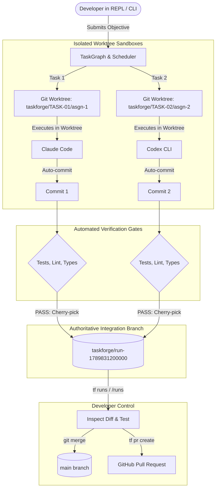

# TaskForge Git Worktrees, Branch Lifecycle & Real-Agent Hardening Guide

**Document Status:** Official Reference & User Guide  
**Version:** v0.1.0  
**Target Audience:** Developers, Platform Engineers, and Multi-Agent Systems Architects  

---

## 1. Executive Summary & The Problem Statement

When using TaskForge to coordinate autonomous AI agents (such as **Anthropic Claude Code**, **OpenAI Codex CLI**, or **Google Antigravity**), developers often have two critical questions:

1. **"Why didn't TaskForge modify or commit directly to my `main` branch?"**
2. **"If I close the terminal or restart TaskForge, how do I know if the task succeeded and what branch the changes were saved to?"**

This document explains the **Zero-Risk Git Worktree Architecture**, how integration branches (`taskforge/run-<runId>`) are named, discovered, and merged, and details the **Real-Agent Hardening** safeguards that protect your codebase and secrets.

---

## 2. The Zero-Risk Git Architecture

Allowing autonomous AI agents to modify a developer's active working directory or commit directly to `main` is inherently risky. Agents could introduce regressions, overwrite uncommitted local work, or cause merge conflicts midway through a run.

TaskForge eliminates this risk through a 5-step lifecycle:



### Step 1: Ephemeral Worktrees (`.taskforge/worktrees/`)
For each task in the dependency graph, TaskForge calls `git worktree add` to create an isolated filesystem sandbox checked out from the base commit. Your active working copy on `main` remains 100% untouched.

### Step 2: Agent Execution & Auto-Commit
The assigned agent works strictly inside its ephemeral worktree. When the agent finishes, TaskForge stages the files and creates an autonomous Git commit tagged with the task ID:
```
feat(TASK-01): completed by Claude Code
```

### Step 3: Deterministic Automated Verification
Before any change is accepted, TaskForge executes the repository's verification suite (`pnpm test`, `pnpm lint`, `tsc`) inside the worktree sandbox. If verification fails, TaskForge launches a bounded rework cycle.

### Step 4: Atomic Integration to `taskforge/run-<runId>`
Once verified, TaskForge creates a dedicated integration branch for the entire run:
```
taskforge/run-<runId>    (e.g., taskforge/run-1789831200000)
```
Each verified task commit is cherry-picked onto this integration branch in deterministic dependency order.

### Step 5: Clean Main & Developer Control
At the end of the run, TaskForge outputs the branch name and exact merge command:
```text
✔ Integration branch ready: taskforge/run-1789831200000
  To merge:           git merge taskforge/run-1789831200000
```
Temporary worktrees are automatically pruned, leaving your repository clean.

---

## 3. How to Find, Inspect, and Merge Integration Branches

If you closed TaskForge, restarted your terminal, or ran tasks in the background, you never need to guess where your changes are.

### Method 1: The TaskForge CLI (`tf runs`)
From any terminal inside your repository:
```bash
tf runs
```
**Example Output:**
```text
  ✦ TaskForge Runs History
  ────────────────────────────────────────────────────────────────
  ● run-1789852516195 [COMPLETED] (2026-09-19 18:15:16)
    Goal:   Implement Redis-backed idempotency lock
    Branch: taskforge/run-1789852516195
    Merge:  git merge taskforge/run-1789852516195

  ● run-1789831200000 [COMPLETED] (2026-09-19 12:40:00)
    Goal:   Migrate persistence layer from commonjs to ESM
    Branch: taskforge/run-1789831200000
    Merge:  git merge taskforge/run-1789831200000
  ────────────────────────────────────────────────────────────────
```

### Method 2: The Interactive REPL (`/runs`)
Inside the `tf` interactive session, simply type `/runs`:
```text
> /runs
✦ TaskForge Runs History
  ────────────────────────────────────────────────────────────────
  ● run-1789852516195 [COMPLETED] ✔ (2026-09-19 18:15:16)
    Goal:   Implement Redis-backed idempotency lock
    Branch: taskforge/run-1789852516195
    Merge:  git merge taskforge/run-1789852516195
  ────────────────────────────────────────────────────────────────
```

### Method 3: Standard Git Commands
Because TaskForge is pure Git under the hood, standard Git commands work instantly:
```bash
# 1. List all TaskForge integration branches
git branch --list 'taskforge/*'

# 2. View recent commits on the integration branch
git log --oneline -n 5 taskforge/run-1789852516195

# 3. Inspect the diff against your current main branch
git diff main..taskforge/run-1789852516195

# 4. Merge verified changes into main
git checkout main
git merge taskforge/run-1789852516195
```

### Method 4: Automated GitHub Pull Request
To create a complete Pull Request with automated audit evidence, verification logs, and token cost metrics:
```bash
tf pr create --base main
```

### Method 5: Cleaning Up Worktrees (`tf clean`)
If an agent crashed, was aborted via `Ctrl+C`, or left orphaned worktrees in `.taskforge/worktrees/`:
```bash
tf clean
```
> [!NOTE]
> `tf clean` safely prunes orphaned temporary worktrees and transient assignment branches, but **never** deletes completed `taskforge/run-<runId>` integration branches or your SQLite history.

---

## 4. Real-Agent Hardening (v0.1 Safe-by-Default Architecture)

To bridge the gap between deterministic software and external CLI agents, TaskForge implements the **Real-Agent Hardening Specification**:

### 4.1 No Silent CLI Bypass
Previous integrations sometimes relied on flags like `--dangerously-skip-permissions` (Claude Code) or `--dangerously-bypass-approvals-and-sandbox` (Codex CLI) to prevent agents from blocking on terminal prompts.

**TaskForge permanently eliminates these flags.** Real CLI harnesses are run without bypass flags, ensuring that dangerous operations cannot execute without governance.

### 4.2 Strict Environment Allowlist & Secret Redaction
When spawning agent subprocesses, TaskForge enforces a strict environment isolation policy:
- **`inherit: false`**: Subprocesses do not inherit arbitrary environment variables.
- **`allow`**: Only explicitly needed system paths (`PATH`, `HOME`, `USER`, `SHELL`) and AI provider keys (`ANTHROPIC_API_KEY`, `OPENAI_API_KEY`, `GEMINI_API_KEY`, etc.) are passed.
- **`denyPatterns`**: Automatically strips any variable matching:
  - `*PASSWORD*`
  - `*SECRET*`
  - `*TOKEN*` (e.g. `GITHUB_TOKEN`, `AWS_SECRET_ACCESS_KEY`)
  
This prevents accidental token leakage to third-party tools or remote servers.

### 4.3 Bidirectional I/O & `RealCliAgentSession`
Instead of treating agent processes as opaque black boxes, TaskForge connects directly to child process `stdin`, `stdout`, and `stderr`:
1. **JSON Event Parsing**: Real-time line-by-line parsing intercepts structured `permission_request`, `question`, and `authentication_required` events.
2. **Tool Use Inspection**: High-risk tool calls (such as `Bash` commands executing `rm -rf`, `sudo`, `npm install`, or `git push`) are intercepted and held for approval.
3. **Interactive Prompt Fallback**: Detects raw CLI interactive prompts (e.g., `(y/n)`, `[y/N]`, `Do you want to proceed?`).
4. **Governed Stdin Responses**: When the user or policy allows an action, `RealCliAgentSession` sends `y\n` to the process stdin. If denied, it writes `n\n`. For text questions, it writes the user's answer directly to stdin.
5. **Clean Cancellation**: Pressing `Ctrl+C` or issuing `/cancel` immediately dispatches `SIGTERM` to the child process.

### 4.4 Agent Preflight Evaluation (`AgentPreflightEvaluator`)
Before any assignment is dispatched to an agent, `AgentPreflightEvaluator` validates:
- **Capability Compatibility**: Ensures read-only agents are never assigned write tasks.
- **Contract Completeness**: Rejects tasks lacking clear objectives or acceptance criteria.
- **Architectural Scope**: Detects unbounded refactoring scopes (e.g., modifying `*` or >10 files) and recommends multi-agent collaboration rather than single-worker execution.

### 4.5 Mandatory Collaborative Verification
When multiple agents collaborate on a task (e.g., an implementer paired with a reviewer), the scheduler mandates that the synthesized solution passes the full automated verification pipeline (`verificationRunner.verify()`) before commits are integrated.

### 4.6 Telemetry-Guided Routing Loop with Zod Validation
The OpenAI Router now queries historical performance metrics from `PerformanceEngine`:
- Per-agent success rates, sample sizes, and composite scores are injected directly into the LLM routing prompt.
- The LLM's structured JSON response is validated at runtime against strict Zod schemas (`RoutingDecisionSchema` and `RoleRequestSchema`), preventing invalid task assignments or malformed payloads.

### 4.7 Opt-in Real-Agent E2E Test Harness
TaskForge includes an opt-in integration test suite (`packages/agents/tests/real-adapters-hardening.test.ts`):
- Unit tests verify flag safety and bidirectional I/O without needing live CLI binaries.
- Setting `TASKFORGE_TEST_REAL_AGENTS=1` enables full end-to-end execution with detected local CLIs in CI or local developer environments.

---

## 5. Summary Cheat Sheet

| Question / Action | Recommended Command |
| :--- | :--- |
| **Where did my changes go?** | Check the integration branch: `taskforge/run-<runId>` |
| **How do I list past runs?** | `tf runs` (from shell) or `/runs` (inside REPL) |
| **How do I see what changed?** | `git diff main..taskforge/run-<runId>` |
| **How do I merge into main?** | `git checkout main && git merge taskforge/run-<runId>` |
| **How do I create a GitHub PR?** | `tf pr create --base main` |
| **How do I clean up worktrees?** | `tf clean` |
| **How do I cancel a running task?** | Press `Ctrl+C` or type `/cancel` |
| **How do I view live agent logs?** | Type `/stream` in the REPL |
